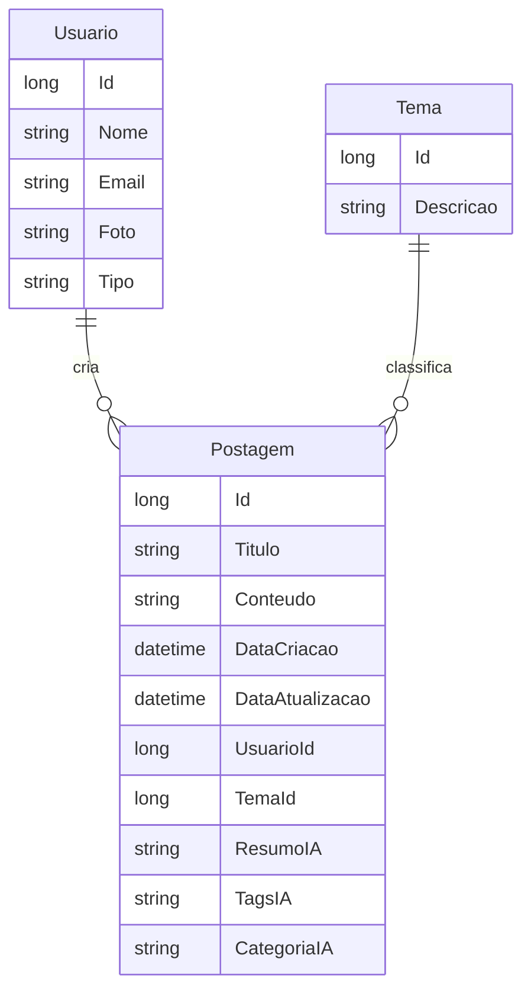

# Entrega do Projeto Blog Pessoal

## 1. Objetivo

O projeto tem como objetivo proporcionar uma experiência prática de desenvolvimento backend utilizando ASP.NET Core 8, aplicando conceitos de arquitetura em camadas, persistência de dados, segurança, documentação, qualidade de código e integração com Inteligência Artificial.

A aplicação simula um blog pessoal onde usuários autenticados podem criar postagens, organizá-las por temas e receber enriquecimento automático com IA no momento do cadastro ou atualização das postagens.

## 2. Recursos implementados

### Usuário

- Cadastro de usuários.
- Login com e-mail e senha.
- Geração de token JWT.
- Atualização de perfil.
- Exclusão de usuários restrita a administradores.
- Controle de permissões por roles: `ADMIN` e `USUARIO`.

### Tema

- Cadastro de temas.
- Atualização de temas.
- Exclusão de temas sem postagens vinculadas.
- Listagem geral e busca por ID.

### Postagem

- Cadastro de postagens vinculadas ao usuário autenticado e a um tema.
- Atualização de postagens.
- Exclusão de postagens.
- Listagem geral.
- Filtro por autor e/ou tema.
- Campos inteligentes gerados pela IA:
  - `ResumoIA`;
  - `TagsIA`;
  - `CategoriaIA`.

### Inteligência Artificial

Foi implementada a funcionalidade **Resumo Inteligente de Postagens**.

Fluxo:

1. O usuário autentica na API.
2. O usuário cria uma postagem.
3. A API envia o conteúdo para o serviço de IA.
4. A IA retorna resumo, tags e categoria.
5. A postagem é salva já enriquecida com essas informações.

Também foi criado o endpoint independente:

```http
POST /api/ia/resumir
```

Exemplo de resposta:

```json
{
  "sucesso": true,
  "mensagem": "Resumo inteligente gerado com sucesso.",
  "dados": {
    "resumo": "Postagem sobre boas práticas em APIs REST.",
    "categoria": "Tecnologia",
    "tags": "API, REST, ASP.NET Core"
  },
  "erros": []
}
```

## 3. Arquitetura

A aplicação segue arquitetura em camadas:

| Camada | Responsabilidade |
|---|---|
| Controllers | Receber requisições HTTP, validar entrada inicial e retornar respostas |
| Services | Concentrar regras de negócio |
| Repositories | Isolar acesso ao banco de dados |
| Models | Representar as entidades persistidas |
| DTOs | Controlar dados de entrada e saída da API |
| Config | Configurações de JWT, IA e seed de roles |
| Middlewares | Tratamento padronizado de exceções |

## 4. Modelagem do domínio



## 5. Segurança

A segurança foi implementada com ASP.NET Core Identity e JWT.

Boas práticas aplicadas:

- Senhas protegidas pelo mecanismo de hash do Identity.
- Tokens JWT com emissor, audiência, expiração e assinatura.
- Endpoints protegidos com `[Authorize]`.
- Controle de permissões com roles.
- Chave JWT configurável por variável de ambiente.
- Chave da OpenAI não armazenada diretamente no código-fonte.

## 6. Qualidade com SonarQube

O projeto inclui:

- `sonar-project.properties` configurado.
- `docker-compose.yml` com SonarQube.
- Script `scripts/run-sonar.sh` para build, testes e análise.
- Workflow de CI em `.github/workflows/quality.yml`.

Métricas acompanhadas:

- Bugs.
- Vulnerabilidades.
- Code smells.
- Cobertura de testes.
- Complexidade ciclomática.
- Duplicações.

## 7. Testes

Foi criada uma estrutura inicial de testes com xUnit.

Testes incluídos:

- Validação do prompt usado na IA.
- Teste de regra simples do serviço de temas.

Sugestões de evolução:

- Testes de integração dos endpoints.
- Testes do fluxo de login.
- Testes com banco em memória.
- Testes de autorização por perfil.

## 8. Como validar a entrega

1. Subir o banco com Docker.
2. Criar as migrations.
3. Atualizar o banco.
4. Executar a API.
5. Acessar o Swagger.
6. Cadastrar um usuário.
7. Fazer login.
8. Copiar o token JWT.
9. Autorizar no Swagger usando `Bearer {token}`.
10. Criar um tema.
11. Criar uma postagem.
12. Verificar se a resposta contém `ResumoIA`, `TagsIA` e `CategoriaIA`.
13. Executar os testes.
14. Executar análise no SonarQube.

## 9. Considerações finais

A entrega atende aos requisitos funcionais, técnicos e adicionais solicitados. O projeto foi estruturado de forma didática para facilitar a leitura, manutenção e evolução pelos estagiários.
